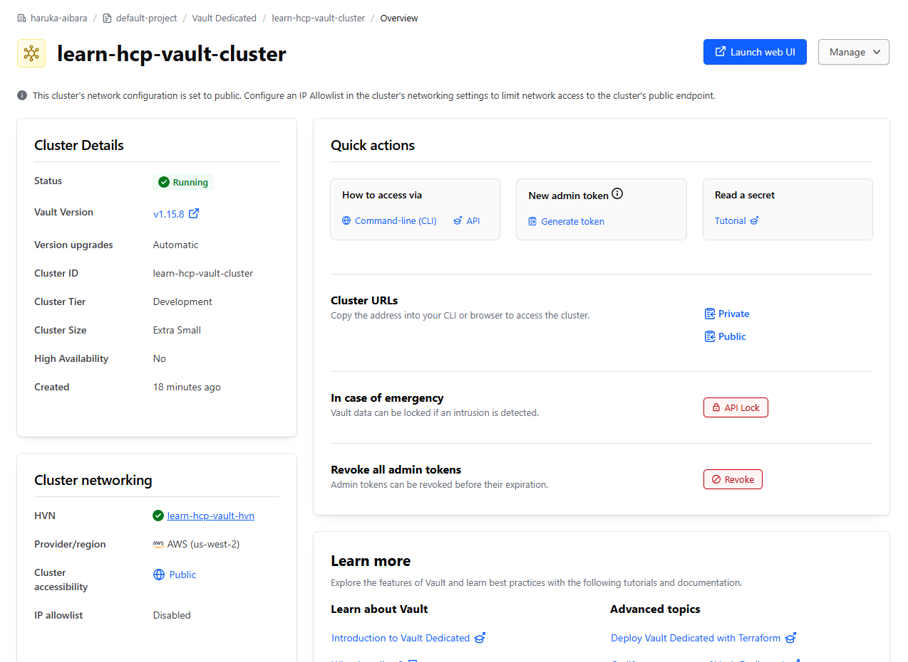
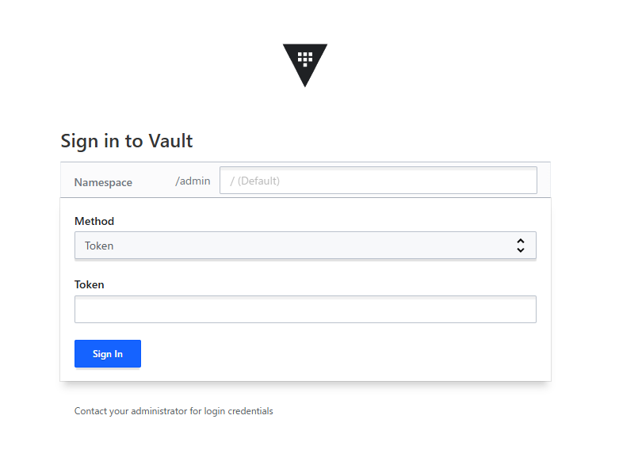

# deploy-hcp-vault-dedicated-with-terraform
https://developer.hashicorp.com/vault/tutorials/terraform-hcp-vault

Note HCP Vault Dedicated Cluster created in this project is set to Public.

## Prerequisites
To complete the steps listed in this tutorial, you need:

 - [x] Terraform CLI installed

 - [x] An HCP account

 - [x] An AWS account

 - [x] git installed

 - [x] AWS IAM credentials configured locally

## After applying

After applying, press Public in the Cluster URLs and open the link in your browser to access the Vault.

